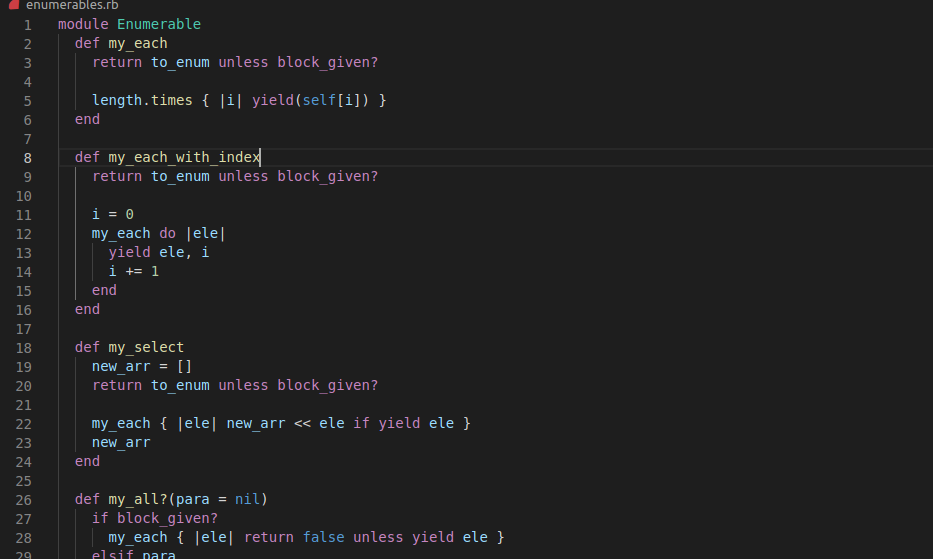

# Enumerables

> Enumerables solution using Ruby language.

## What are enumerables?
>Enumeration refers to traversing over objects. In Ruby, we call an object enumerable when it describes a set of items and a method to loop over each of them.

The built-in enumerables get their enumeration features by including the Enumerable module, which provides methods like #include?, #count, #map and #select amongst others.

[Read me on Appsignal blog](https://blog.appsignal.com/2018/05/29/ruby-magic-enumerable-and-enumerator.html) 

## Built With

- Ruby Programming Language

## Getting Started

To get a local copy up and running follow these simple example steps.

- Go to "https://github.com/Stephanie041996/enumerables"
- Click on the green button with text "code" and copy the  HTTPS/SSH URL
- If you cannot understand the instruction above, cppy this: github.com/Stephanie041996/enumerables.git
- In your computer, open your terminal application, type in git clone followed by the link you copied
- git clone git@github.com/Stephanie041996/enumerables.git
- to run type the command "ruby enumerables.rb" in your terminal

## Run tests

- In your terminal, type in "bundle install" to download and install the testing framework
- Run "bundle exec rspec" for running the tests already written.

## Authors

👤 **Samrood Ali**
- GitHub: [@githubhandle](https://github.com/SamroodAli)
- LinkedIn: [LinkedIn](https://www.linkedin.com/in/samrood-ali/)

👤 **Stephanie Sakuhuni**

- GitHub: [@githubhandle](stephanie041996)
- LinkedIn: [LinkedIn](https://www.linkedin.com/in/stephanie-sakuhuni-a81029140/)

## 🤝 Contributing

- Odin project
- Microverse

Feel free to check the [issues page](issues/).

## Show your support

Give a ⭐️ if you like this project!

## 📝 License

This project is [MIT](lic.url) licensed.
